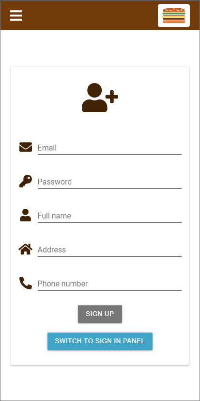
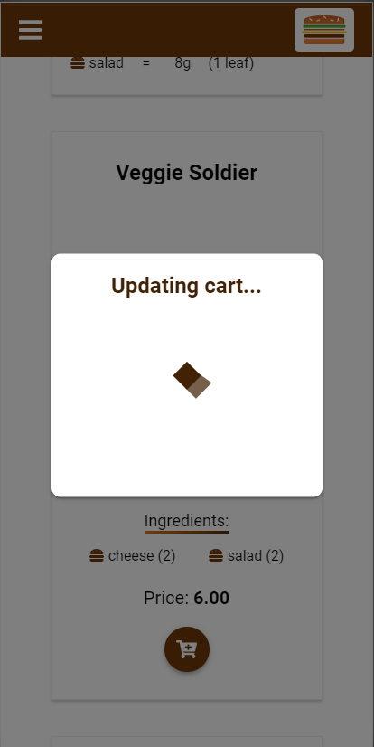
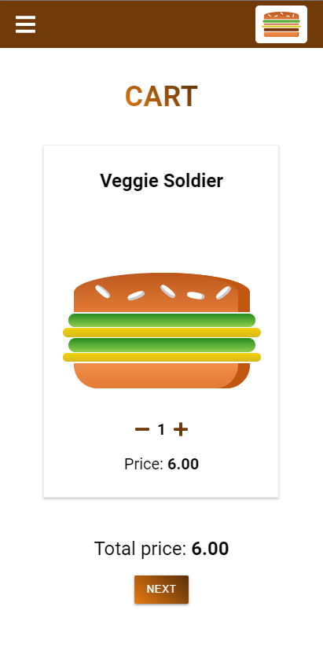
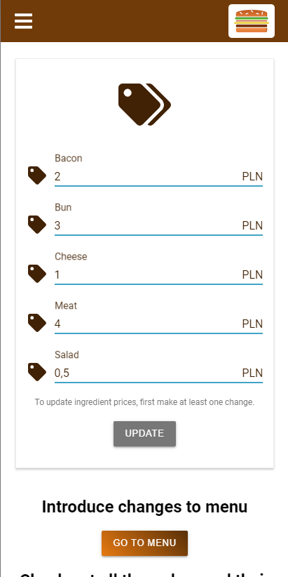
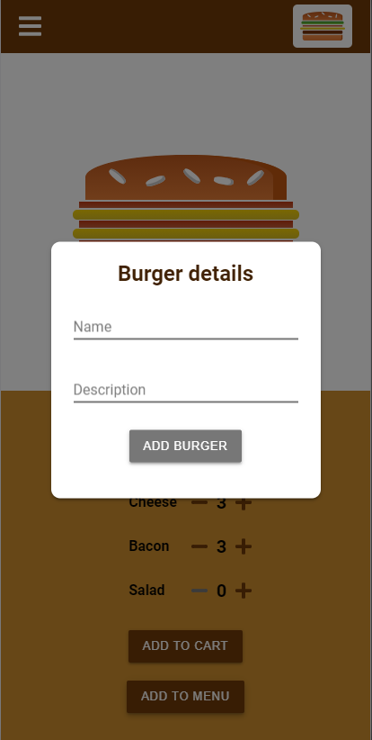
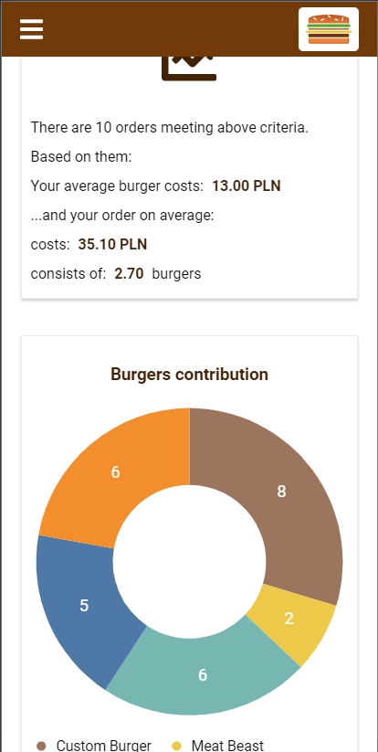
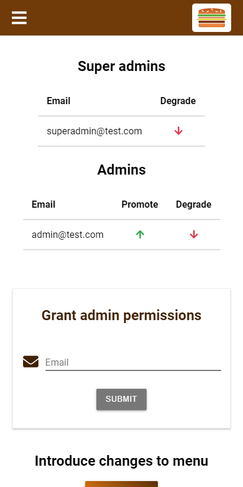
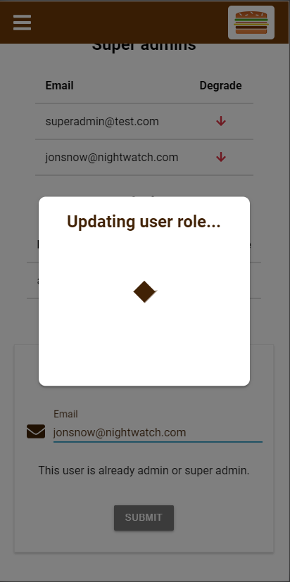
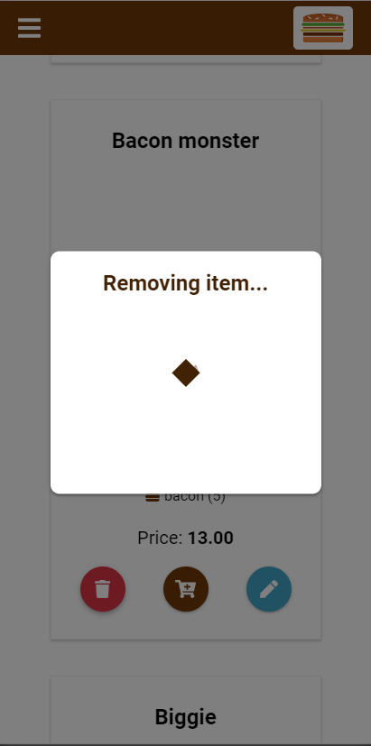

# Burger Palace App
Full-stack web app created with React.js & Firebase.
## Table of contents
* [Introduction](#introduction)
* [Technologies](#technologies)
* [Setup](#setup)
* [Features](#features)
* [Project status](#project-status)
* [Inspiration](#inspiration)

## Introduction
This app was created in order to practice building full-stack web app and gain some new skills along the way.

## Technologies
Project was created with:
* Firebase
* JavaScript (ES6+)
* React.js (16.13)
* React Router (5.2)
* Redux (7.2)
* React Redux Firebase (3.7)
* Redux Firestore (0.13)
* Framer Motion (2.7)
* D3 (6.1)

## Setup
To run this project, install it locally using npm:
```
npm install
npm start
```
Or [click here to check out live version](https://burger-project-fa445.web.app/)

## Features
As a user you can:
* sign up/in
* add menu burgers, as well as custom ones built in Burger Builder section, to the cart
* check out - as a result your order is added to the table in Orders section, where you can browse through your order history (applying filters is also possible) and related stats

  

As an admin, apart from the actions available for the users, you can:
* browse through all users orders
* change ingredient prices - as a result all prices of the existing menu burgers are recalculated
* add new burgers to the menu
* update/delete burgers which you previously created

  

Super admins (inaccessible for the public), apart from the actions available for the admins, can:
* manage permissions
* update/delete any burger

  

In order to play with the app, apart from creating your own account, you can use one of the existing accounts available for the public:
* user@test.com, password: user1234 
* admin@test.com, password: admin1234

## Project status
I consider this project finished.

## Inspiration
I was inspired by the [course](https://www.udemy.com/course/react-the-complete-guide-incl-redux/) project by Maximilian Schwarzmüller.

